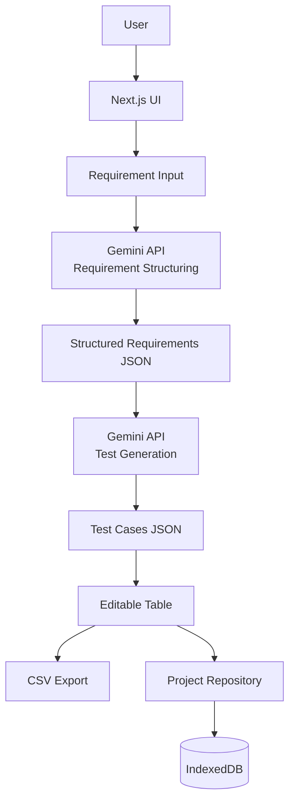

# SpecPilot

AIを活用して、要件定義からテスト設計までを支援する設計支援ツールです。

SpecPilotは、ソフトウェア開発における要件・設計・テストの整合性向上を目的として開発しています。

現在は個人開発のMVPとして、

* 要件整理
* テストケース生成
* CSV出力
* IndexedDBによるブラウザ内保存
* 自動保存
* 再生成
* サンプルプロジェクト

を実現しており、将来的には設計成果物のトレーサビリティや設計資産の再利用（RAG）まで対応することを目指しています。

---

## 🚀 Overview

ソフトウェア開発では、

* 要件定義書
* 基本設計書
* 詳細設計書
* テスト仕様書

が別々に作成されることが多く、

* 要件漏れ
* テスト漏れ
* ドキュメント間の不整合
* 属人的な設計品質

といった課題が発生します。

SpecPilotは要件を起点に情報を構造化し、設計・テスト工程へ繋げることで、設計品質の向上と成果物作成の効率化を目指します。

---

## 💡 Why I Built This

システムエンジニアとして、

* 基本設計
* 詳細設計
* 結合テスト

に携わる中で、

「要件とテスト仕様の整合性を維持すること」

に多くの時間が費やされていることを実感しました。

また、

* Excel管理
* ドキュメントの粒度差
* テスト観点の属人化

といった課題も頻繁に発生します。

SpecPilotは、AIによる構造化と標準化によってこれらの課題を改善することを目的としています。

---

## ✨ Current Features

### プロジェクト作成

プロジェクト単位で、要件とテストケースを管理できます。

---

### AI要件整理

Gemini APIを利用し、自然言語で入力された要件を構造化します。

#### Input

```text
ユーザー登録機能を作りたい
メール認証を行いたい
```

#### Output

```json
{
  "requirements": [
    {
      "feature": "ユーザー登録",
      "description": "ユーザーがアカウント登録できる",
      "acceptanceCriteria": [
        "メールアドレスを入力できる",
        "認証メールを送信できる",
        "認証完了後に利用開始できる"
      ]
    }
  ]
}
```

---

### テストケース生成

Acceptance Criteriaからテストケースを生成します。

```json
{
  "title": "メールアドレス入力",
  "precondition": "登録画面を開いている",
  "steps": "...",
  "expected": "...",
  "type": "normal"
}
```

---

### 編集可能テーブル

生成したテストケースをブラウザ上で編集できます。

* 行追加
* 行削除
* セル編集

---

### CSV出力

生成したテストケースをCSV形式で出力できます。

---

### 自動保存・再生成

編集したテストケースは自動保存されます。
生成結果が期待と異なる場合は、テストケースを再生成できます。

---

### サンプルプロジェクト

初回利用時に、サンプルプロジェクトを作成して動作を確認できます。

---

### ローカル保存

ブラウザのIndexedDBを利用して、

* プロジェクト
* 要件
* テストケース

を保存します。保存処理はRepositoryとして抽象化しており、将来的にAPI/DB保存へ移行しやすい構成にしています。

---

## 🏗 Architecture

現在はVercel Free Plan上で動作するMVPとして構築しています。



---

## 🛠 Technology Stack

### Frontend

* Next.js
* React
* TypeScript
* Tailwind CSS

### AI

* Gemini API

### Storage

* IndexedDB

### Export

* CSV

### Deployment

* Vercel Free Plan

---

## 📷 Screenshots

### Project Creation


### Requirement Structuring


### Test Case Generation


### Project List


---

## 🎯 Roadmap

### Phase 0 - MVP Completion

個人プロダクトとして利用可能な状態まで完成させる。

#### Features

* Project Creation
* IndexedDB保存
* AI要件整理
* テストケース生成
* 編集可能テーブル
* CSV出力
* AIレスポンス検証
* 保存処理のRepository抽象化

#### Status

✅ Implemented

---

### Phase 1 - UX Improvements

使いやすさ向上。

#### Features

* 自動保存
* エラーハンドリング改善
* 再生成機能
* サンプルプロジェクト
* UI改善
* 削除確認UI改善
* 保存状態表示の改善
* エラー内容の具体化
* プロジェクト一覧の情報整理
* モバイル表示調整

#### Status

✅ Implemented

---

### Phase 2 - Requirement Management

要件管理強化。

#### Features

* 要件追加
* 要件更新
* 要件削除
* テストケース再生成
* 要件ステータス管理
* 要件ID表示
* 初回入力の編集・要件/テスト再生成
* 要件変更後の再生成アラート

#### Status

✅ Implemented

---

### Phase 3 - Version Management

テストケースの変更履歴を扱いやすくする。

#### Features

* バージョン一覧表示
* draftと正式保存版の区別
* バージョンプレビュー
* バージョン復元
* バージョン比較

#### Status

✅ Implemented

---

### Phase 4 - Markdown Export

設計成果物として利用しやすい形式で出力。

#### Features

* requirements.md
* test-spec.md
* Markdownプレビュー
* Markdownテンプレート

#### Status

📅 Planned

---

### Phase 5 - Storage Improvements

データ量増加に対応。

#### Features

* 大量データ保存
* プロジェクト管理強化
* プロジェクトコピー
* API/DB保存への移行

#### Status

📅 Planned

---

### Phase 6 - Basic Design Support

要件から基本設計情報を生成。

#### Features

* 画面設計生成
* API設計生成
* DB設計生成
* 入力チェック仕様生成

#### Status

📅 Planned

---

### Phase 7 - Detailed Design Support

基本設計から詳細設計へ展開。

#### Features

* コンポーネント設計
* クラス設計
* シーケンス設計
* バリデーション設計

#### Status

📅 Planned

---

### Phase 8 - Traceability

要件・設計・テストを関連付け。

```text
REQ-001
 ↓
DESIGN-001
 ↓
TEST-001
```

#### Features

* 影響分析
* 未対応テスト検出
* トレーサビリティ管理

#### Status

📅 Planned

---

### Phase 9 - Cloud Sync

複数端末対応。

#### Features

* PostgreSQL
* Supabase Auth
* クラウド保存
* プロジェクト同期

#### Status

📅 Planned

---

### Phase 10 - Knowledge Base & RAG

既存設計資産の活用。

#### Features

* Markdown取り込み
* Excel設計書取り込み
* テスト仕様書取り込み
* 類似設計検索
* ナレッジ検索
* RAGによる生成支援

#### Technology

* PostgreSQL
* pgvector
* Embeddings
* Hybrid Search

#### Status

📅 Planned

---

### Phase 11 - Enterprise Customization

企業向け機能。

#### Features

* カスタムMarkdownテンプレート
* カスタムCSVテンプレート
* 設計標準反映
* レビュー基準反映
* ローカルLLM対応
* オンプレミス対応

#### Status

📅 Planned

---

## 🔮 Future Vision

SpecPilotは単なるAI生成ツールではなく、

```text
要件定義
    ↓
基本設計
    ↓
詳細設計
    ↓
テスト設計
```

を一貫して支援する設計プラットフォームを目指しています。

将来的には企業が保有する

* 設計書
* テスト仕様書
* レビュー指摘
* 開発標準

などを活用し、組織固有の設計品質やテスト観点をAI生成へ反映できる世界を目指しています。

---

## 🧭 Design Principles

* まず小さく完成させる
* 実際に使えるプロダクトを優先する
* AI出力は編集可能な成果物として扱う
* 無料構成で価値検証を行う
* 将来的な企業利用を見据えた設計を行う

---

## 🏃 Local Development

### Clone

```bash
git clone https://github.com/your-account/specpilot.git

cd specpilot
```

### Install

```bash
npm install
```

### Environment Variables

`.env.local`

```env
GEMINI_API_KEY=your_gemini_api_key
```

### Run

```bash
npm run dev
```

---

## 👨‍💻 Author

Hiroki Kawamura

Systems Engineer / Frontend Developer

基本設計〜結合テストの経験をもとに、AIを活用した設計支援プロダクトを開発しています。
