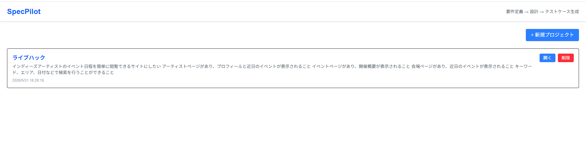
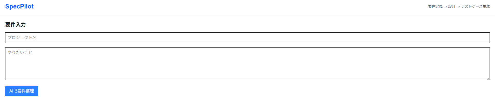
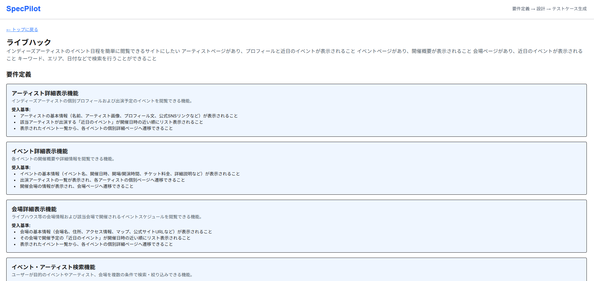
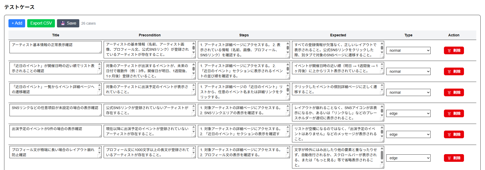

# SpecPilot

SpecPilotは「要件→設計→テストケース」を自動生成するツールです

### ◆ 概要

設計〜テスト工程における抜け漏れや属人化を解消するための支援ツールです。
要件入力から設計、テストケース生成までを一貫して行うことができます。

### ◆ デモ
以下にデモがあります。
https://spec-pilot-xi.vercel.app/

現在はデモのため、要件定義とテストケースのみ生成できます。
生成は無料枠のみとしておりLocalStorageへの保存となっています。

### ◆ 想定ユーザー

- 設計やテストの抜け漏れに課題を感じているエンジニア
- 品質を担保しながら開発効率を上げたいチーム

### ◆ 解決する課題
開発現場で以下の課題を感じたことをきっかけに開発しました。

- 設計書やテストケースの品質が担当者に依存する
- テストケース作成に時間がかかる
- 要件〜設計〜テストの一貫性が担保されない
- レビュー時に手戻りが発生しやすい

### ◆ 主な機能
- 要件から設計項目を自動生成
- 設計内容からテストケースを生成
- テーブル形式での編集UI
- CSVエクスポート機能

### ◆ 画面イメージ

TOP
<p align="center">
  
</p>

要件入力 → 設計生成 → テストケース生成までを一貫して行えます

新規入力
<p align="center">
  
</p>

結果-要件定義
<p align="center">
  
</p>

結果-テストケース
<p align="center">
  
</p>

### ◆ 技術スタック
- Next.js
- TypeScript
- React
- Gemini API

### ◆ 工夫した点
- AIの生成結果をそのまま使うのではなく、編集可能なUIとして提供した点
- 要件 → 設計 → テストの流れを意識した構造設計
- 実務での使いやすさを意識したシンプルなUI

### ◆ 今後の改善
- 基本設計,詳細設計の出力
- チームでの共有機能
- バージョン管理機能
- 要件追加機能
- テストケース生成精度の向上
- CI/CDとの連携

### ◆ 開発背景

実務の中で、設計やテスト工程において
抜け漏れや認識ズレが発生しやすいと感じたことがきっかけです。

特にテストケースは人によって粒度が異なり、
品質と効率の両立が難しいと感じていました。

そのため、要件から設計、テストまでをAIの伴走して一貫して扱うことで、開発プロセス全体の品質向上を目指しました。

------------------------------
# other
This is a [Next.js](https://nextjs.org) project bootstrapped with [`create-next-app`](https://nextjs.org/docs/app/api-reference/cli/create-next-app).

## Getting Started

First, run the development server:

```bash
npm run dev
# or
yarn dev
# or
pnpm dev
# or
bun dev
```

Open [http://localhost:3000](http://localhost:3000) with your browser to see the result.

You can start editing the page by modifying `app/page.tsx`. The page auto-updates as you edit the file.

This project uses [`next/font`](https://nextjs.org/docs/app/building-your-application/optimizing/fonts) to automatically optimize and load [Geist](https://vercel.com/font), a new font family for Vercel.

## Learn More

To learn more about Next.js, take a look at the following resources:

- [Next.js Documentation](https://nextjs.org/docs) - learn about Next.js features and API.
- [Learn Next.js](https://nextjs.org/learn) - an interactive Next.js tutorial.

You can check out [the Next.js GitHub repository](https://github.com/vercel/next.js) - your feedback and contributions are welcome!

## Deploy on Vercel

The easiest way to deploy your Next.js app is to use the [Vercel Platform](https://vercel.com/new?utm_medium=default-template&filter=next.js&utm_source=create-next-app&utm_campaign=create-next-app-readme) from the creators of Next.js.

Check out our [Next.js deployment documentation](https://nextjs.org/docs/app/building-your-application/deploying) for more details.
